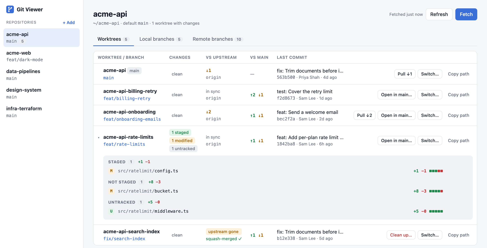

# Git Viewer

Git Viewer is a small web app that runs on your machine and shows your local git repositories in the browser. For each repository you see its worktrees, local and remote branches, uncommitted changes, and how far each branch is ahead of or behind its upstream and the default branch. From the same page you can switch branches, check out remote branches, preview, discard, or commit changes, push, and delete merged worktrees.

It runs your own `git` on your own machine. Nothing leaves your laptop, and there is no account to create.



For a full list of what each screen shows and does, see [Features](docs/features.md).

## Before you start

You need:

- macOS or Linux.
- [Node.js](https://nodejs.org/) 18 or later. Check with `node --version`.
- git 2.31 or later. Check with `git --version`.

## Set up git and GitHub access

Git Viewer runs git in the background, without a terminal. Git can't ask you for a password or an SSH key passphrase there. So **Fetch** and **Clone** work only if your GitHub access already works without a prompt. Set that up once, then test it.

### Set your git identity

Git Viewer doesn't commit, but your repositories need an identity for the commits you make yourself. Use the email address on your GitHub account:

```bash
git config --global user.name "Your Name"
git config --global user.email "you@example.com"
```

### Connect to GitHub over SSH or HTTPS

Your repositories' remote URLs decide which one you need. Run `git remote -v` in a repository. A URL like `git@github.com:org/repo.git` uses SSH. A URL like `https://github.com/org/repo.git` uses HTTPS.

**SSH.** If you already have an SSH key on GitHub, load it into the SSH agent so its passphrase isn't asked for again. On macOS, the keychain keeps it across restarts:

```bash
ssh-add --apple-use-keychain ~/.ssh/id_ed25519
```

On Linux, run `ssh-add ~/.ssh/id_ed25519`. If you don't have a key yet, follow GitHub's guide [Generating a new SSH key and adding it to the ssh-agent](https://docs.github.com/en/authentication/connecting-to-github-with-ssh/generating-a-new-ssh-key-and-adding-it-to-the-ssh-agent).

**HTTPS.** Install the [GitHub CLI](https://cli.github.com/) and let it store your credentials for git:

```bash
gh auth login
gh auth setup-git
```

### Test the connection

Run one of these commands. Use a repository you have access to:

```bash
# SSH
GIT_SSH_COMMAND="ssh -o BatchMode=yes" git ls-remote git@github.com:YOUR-ORG/YOUR-REPO.git HEAD

# HTTPS
GIT_TERMINAL_PROMPT=0 git ls-remote https://github.com/YOUR-ORG/YOUR-REPO.git HEAD
```

If it works, the command prints one line with a commit hash and `HEAD`. These commands run git the way Git Viewer does, so if they pass, **Fetch** and **Clone** work too.

## Install and start Git Viewer

1. Clone this repository and install its dependencies:

   ```bash
   git clone git@github.com:OWNER/git-viewer.git ~/git-viewer
   cd ~/git-viewer
   npm run install:all
   ```

2. Start the app:

   ```bash
   ./start.sh
   ```

   The first start builds the front end, which takes a few seconds. Your browser then opens http://localhost:3024.

3. To stop the app, run `./stop.sh`.

On macOS you can also run `bash setup.sh` once. It creates a **Git Viewer.app** launcher on your Desktop. The launcher starts the app, or offers to stop it if it's already running.

After you pull new changes to Git Viewer, run `./start.sh` again. It rebuilds and restarts the app when the code has changed.

## Add your repositories

Git Viewer lists every repository it finds directly inside your home folder. A repository at `~/my-project` appears on its own. One at `~/code/my-project` doesn't, because it's two levels down.

To add repositories the scan doesn't find, use one of these:

- **Clone a new repository.** Click **+ Add** in the sidebar, keep **Clone from URL** selected, and paste the repository's URL. Git Viewer clones it into your home folder by default and opens it when the clone finishes.
- **Add a repository that's already on disk.** Click **+ Add**, choose **Add existing folder**, and enter its path, for example `~/code/my-project`. Git Viewer remembers it. To hide it again, open it and click **Remove from list**. Its files stay where they are.
- **Scan other folders.** If you keep your repositories in one place, list that folder under `roots` in `~/.git-viewer/config.json`. Create the file if it doesn't exist yet:

  ```json
  {
    "roots": ["~/code", "~/work"]
  }
  ```

  Restart the app with `./stop.sh` and `./start.sh` to apply the change. The `roots` list replaces the default, so add `"~"` to keep scanning your home folder. To try other folders for one run without editing the file, start the app with `GIT_VIEWER_ROOTS=~/code:~/work ./start.sh`.

Worktrees don't need adding. A repository's worktrees appear under it wherever they are on disk.

## Move your setup to a new machine

Your Git Viewer setup is one file, `~/.git-viewer/config.json`. It holds your scan folders and the repositories you added by hand. Your repositories, git identity, and GitHub access aren't part of it.

1. On the new machine, follow [Set up git and GitHub access](#set-up-git-and-github-access) and [Install and start Git Viewer](#install-and-start-git-viewer).

2. Copy the config file from the old machine. For example, over SSH:

   ```bash
   mkdir -p ~/.git-viewer
   scp OLD-MACHINE:.git-viewer/config.json ~/.git-viewer/config.json
   ```

3. Put your repositories at the same paths as on the old machine. Clone them again, or copy their folders. Paths in your home folder are saved as `~/…`, so they work even if your user name is different. Git Viewer skips listed repositories that don't exist yet, and shows them once they do.

4. Restart the app with `./stop.sh` and `./start.sh`.

Don't copy `~/.git-viewer/discarded/`. It holds short-lived backups of discarded files from the old machine. The **Open in main** state in the config file resets on its own when the new machine's repositories don't match it.

## Fix common problems

**`fatal: could not read Username for 'https://github.com': terminal prompts disabled`**
Git has no stored credentials for HTTPS. Run `gh auth login` and `gh auth setup-git`, as described in [Connect to GitHub over SSH or HTTPS](#connect-to-github-over-ssh-or-https).

**`Permission denied (publickey)`**
Your SSH key isn't loaded in the SSH agent, or GitHub doesn't know the key. Run `ssh-add -l` to list the loaded keys. If the list is empty, load your key with `ssh-add`, as described in [Connect to GitHub over SSH or HTTPS](#connect-to-github-over-ssh-or-https).

**A repository doesn't appear in the sidebar.**
It isn't directly inside a scanned folder. Add it with **+ Add** → **Add existing folder**.

**Port 3024 is already in use.**
Another program uses the port. Start Git Viewer on a different port with `PORT=3030 ./start.sh`.

**The app doesn't start.**
The server writes its log to `/tmp/git_viewer_server.log`. To see the last lines, run `tail /tmp/git_viewer_server.log`.

## Develop Git Viewer

Run `npm run dev` for live reload. The API runs on port 3024 and the front end on http://localhost:5174.

- `server/` is an Express app. It runs git commands and returns the results as JSON.
- `client/` is a React app, built with Vite.

To update the screenshots in `docs/screenshots/` after a UI change, run `scripts/screenshots/run.sh`. It builds made-up demo repositories in a temporary folder, so no real data ends up in the images. It needs Google Chrome.

The server listens on 127.0.0.1 only and rejects requests from other websites. It runs git without a shell. Before it acts on a branch name, worktree path, or file path, it checks the value against git's own lists.
