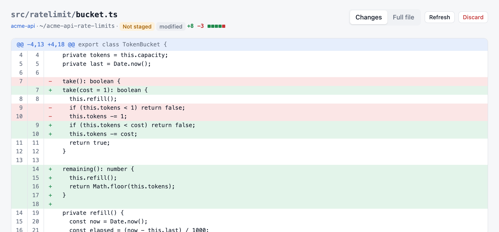
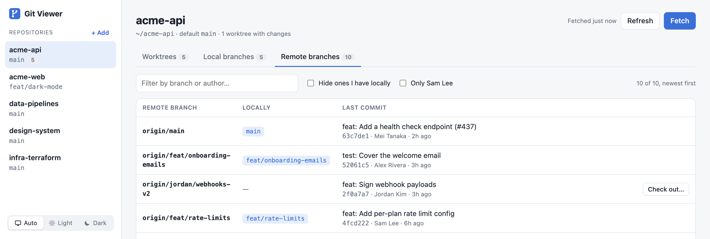

# Features

This page lists what Git Viewer shows and what each action does. To install the app, see the [README](../README.md).

Git Viewer commits only the files you check and pushes only when you click **Push**. It never force-pushes or resets. It deletes files or branches only through **Discard** and **Clean up**, after you confirm.

## Sidebar

The sidebar lists every repository Git Viewer knows about, with the branch its main folder is on. If a repository has more than one worktree, a number next to the branch shows how many.

- **+ Add** clones a repository from a URL, or adds a repository that's already on disk. See [Add your repositories](../README.md#add-your-repositories).
- The switch at the bottom picks the color theme: **Auto** follows your system setting, and **Light** and **Dark** override it. The browser remembers the choice, and open file views follow it.

## Repository header

- **Fetched … ago** is the time of the last fetch.
- **Refresh** reloads the page's data. The page also refreshes every 30 seconds and when you return to its browser tab.
- **Fetch** runs `git fetch --all --prune`.
- **Remove from list** appears for repositories added by hand. It hides the repository and leaves its files alone.

## Worktrees tab

One row per worktree. The main folder is marked **main**.

| Column | Shows |
| --- | --- |
| Worktree / branch | Folder name and the branch checked out in it. |
| Changes | Counts of staged, modified, untracked, and conflicted files, or **clean**. Also shows a merge, rebase, cherry-pick, revert, or bisect in progress. |
| vs upstream | Commits ahead (↑) and behind (↓) the upstream branch. **upstream gone** means the remote branch was deleted. |
| vs default | Commits ahead and behind the default branch, for example `master`. |
| Pull request | The branch's pull request on GitHub. See [Pull requests](#pull-requests). |
| Last commit | Subject, hash, author, and age. Click the subject to see the full commit message. |

Click a row that has changes to expand it. The expanded row lists the changed files in groups: **Conflicts**, **Staged**, **Not staged**, and **Untracked**. Each file shows lines added and removed.

### Actions on a worktree

- **Push ↑N** pushes the branch's new commits. See [Commit and push](#commit-and-push).
- **Pull ↓N** fast-forwards the branch to its upstream. It never creates a merge commit, and it's offered only when the branch has no commits of its own.
- **Switch…** switches the worktree to another local branch. A branch that's checked out in another worktree can't be picked.
- **Open in main…** checks out this worktree's branch in the main folder. See [Open a worktree's branch in the main folder](#open-a-worktrees-branch-in-the-main-folder).
- **Clean up…** appears when the upstream is gone or the branch was never pushed. See [Clean up merged branches](#clean-up-merged-branches).
- **Copy path** copies the worktree's folder path.

## Changed files

- Click a file name to open its diff in a new browser tab. **Changes** shows the changed lines with three lines of context. **Full file** shows the whole file with the changes highlighted. A new file shows as all added lines.
- **Discard** asks for a second click within 3 seconds, then:

  | Group | Discard does |
  | --- | --- |
  | Not staged | Restores the file to its staged version, or to the last commit if nothing is staged. |
  | Staged | Restores the file to the last commit. A newly added file is deleted. |
  | Untracked | Deletes the file. |
  | Conflicts | Not available. Resolve conflicts in your editor. |

  Before it discards, Git Viewer copies the file to `~/.git-viewer/discarded/`. The message that confirms the discard has an **Undo** button for 12 seconds. Undo puts the content back as an unstaged change. Backups are deleted after 7 days.

## Pull requests

For repositories whose `origin` is on GitHub, the Worktrees and Local branches tabs show each branch's pull request:

- The number links to the pull request. Its state is **Open**, **Draft**, **Merged**, or **Closed**. Hover over the number to see the title and the comment and review-thread counts.
- For open pull requests, a second line shows the checks (**✓ checks**, **✗ N failing**, or **◷ N running**), the review decision (**approved**, **changes requested**, or **needs review**), and the number of unresolved review threads. Hover over **failing** to see which checks failed.
- A pushed branch without a pull request shows **Create PR**, which opens GitHub's page for opening one.

The data comes from the GitHub CLI, `gh`, with your `gh auth login`. Git Viewer stores no token. It asks GitHub at most once a minute per repository, plus when you click **Refresh**, **Fetch**, or **Push**. If `gh` isn't installed or isn't logged in, the column says so and the rest of the app works as usual.

## Commit and push

In an expanded worktree row, each changed file has a checkbox, and each group has one that selects all its files. Files that are already staged start out checked.

To commit, check the files, write a message, and click **Commit N files**, or press ⌘↵. Git Viewer commits the checked files as they are on disk, including new and deleted files. Staged files you didn't check stay staged and aren't part of the commit. Your repository's commit hooks run as usual. If a hook fails, its output appears and nothing is committed.

Committing isn't possible in these cases, and the panel says why:

- The worktree isn't on a branch (detached), for example the main folder while it's testing a copy.
- A merge, rebase, cherry-pick, or revert is in progress.
- A file has conflicts.

**Push ↑N** appears on a branch with commits its remote branch doesn't have. A branch that was never pushed shows **Push**, which also sets its upstream. After a commit, the confirmation message offers **Push** too. When GitHub replies with a link to open a pull request, the message offers **Open PR**.

Git Viewer never force-pushes. If the remote branch has commits you don't have, the push is rejected and you pull or rebase in a terminal. Branches whose remote branch was deleted don't offer **Push**, because pushing would bring the deleted branch back. Pushing the default branch asks for confirmation.

## Local branches tab

One row per local branch, newest first. The columns match the Worktrees tab. Under the branch name, **checked out in** names the worktree that has it.

- **not tracked** means a remote branch with the same name exists, but the local branch doesn't track it. **Track** sets it as the upstream.
- An upstream with a different name than the branch is shown in full, for example `→ origin/master`.
- **Check out…** checks out the branch in an existing worktree or in a new one.
- **Push ↑N**, **Pull ↓N**, **Open in main…**, and **Clean up…** work as on the Worktrees tab.

## Remote branches tab

One row per remote branch, newest first.

- The filter box matches branch names and authors.
- **Hide ones I have locally** hides remote branches that a local branch tracks or shares a name with.
- **Only *your name*** shows branches whose last commit is yours, by your `git config user.name`.
- **Check out…** creates a local branch that tracks the remote branch. You choose whether to open it in a new worktree, switch an existing worktree to it, or only create the branch.
- **Track** appears when a local branch with the same name exists. It sets the remote branch as that branch's upstream.

## Open a worktree's branch in the main folder

Git allows a branch in only one worktree at a time. **Open in main…** offers two ways to get a worktree's branch into the main folder:

- **Test a copy** checks out the branch's latest commit in the main folder, without the branch itself. The worktree keeps the branch, so work there continues. When the branch gets new commits, the banner offers **Update ↓N**. **Back to *branch*** returns the main folder to the branch it was on.
- **Move the branch** detaches the worktree, which keeps the same commit and files, and checks out the branch in the main folder. You can commit there. **Return branch** puts the main folder back on its previous branch and gives the branch back to the worktree.

While a branch is open in the main folder, a banner at the top of the repository shows the state and the way back.

## Clean up merged branches

**Clean up…** appears on two kinds of branches:

- Branches whose remote branch was deleted. They show **upstream gone**. Git notices the deletion when you click **Fetch**, which prunes deleted remote branches.
- Branches that were never pushed. They have no upstream and no remote branch with the same name, and show **local only**. A never-pushed branch without commits of its own shows **no commits yet**. It gets **Clean up…** only when no worktree has it checked out, because a worktree with such a branch is usually work that just started.

For both, Git Viewer checks whether the work landed in the default branch:

- **merged ✓**: the branch's commits are in the default branch.
- **squash-merged ✓**: a commit in the default branch has the same combined change, as a GitHub squash merge produces.
- **not merged**: Git Viewer couldn't find the work.

The dialog deletes the worktree folder, the local branch, or both. Deleting the folder also deletes ignored files in it, such as `node_modules` and `.env`. You must type the branch name to confirm in two cases: the branch isn't merged, or the worktree has uncommitted or untracked files. The dialog lists the files you would lose.

Git Viewer won't delete the default branch, a branch checked out in the main folder, a branch that's open in the main folder, or a locked worktree.

## Where your data lives

Git Viewer stores nothing in its own folder. Each user's state lives in their home folder:

| Path | Holds |
| --- | --- |
| `~/.git-viewer/config.json` | Scan folders (`roots`), repositories added by hand (`extraRepos`), and branches open in the main folder (`mainLinks`). Paths in your home folder are saved as `~/…`. |
| `~/.git-viewer/discarded/` | Backups of discarded files, kept for 7 days. |

## Settings

Set these environment variables when you run `./start.sh`:

| Variable | Default | Effect |
| --- | --- | --- |
| `PORT` | `3024` | Port the app listens on. |
| `GIT_VIEWER_ROOTS` | `roots` in the config file, else your home folder | Folders to scan for repositories, separated by colons. Overrides `roots`. |
| `GIT_VIEWER_CONFIG` | `~/.git-viewer/config.json` | Path of the config file. |
| `GIT_VIEWER_BACKUPS` | `~/.git-viewer/discarded` | Folder for discard backups. |
